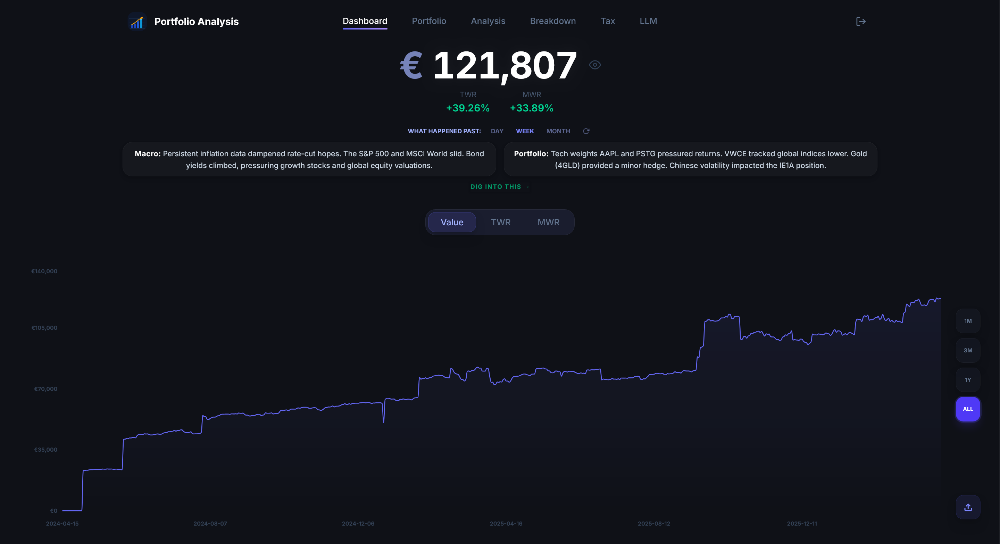
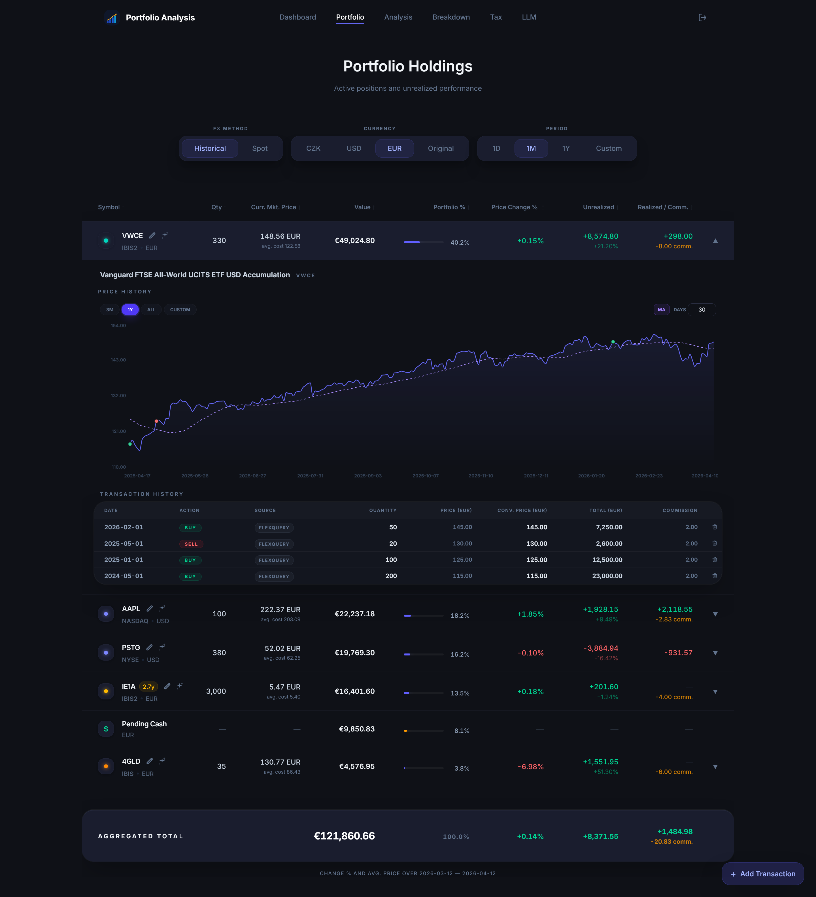

# portfolio-analysis

A self-hosted web application for analysing stock and ETF portfolios held at Interactive Brokers, with optional supplemental data from E\*Trade (for RSU/ESPP positions). It reconstructs holdings and cost bases entirely from transaction history, calculates time- and money-weighted returns, runs portfolio analytics against a benchmark, shows breakdowns by sector/country/asset type, and can generate a Czech tax report. A Google Gemini integration adds LLM-powered portfolio summaries and freeform chat. The backend is Go (Gin + GORM), the frontend is React + TypeScript + Vite. The two can ship either as a single self-contained binary, or a Docker container.

---

## Screenshots



## Features

### Portfolio tracking
- Reconstructs current holdings and average cost basis purely from trade history (no stored snapshot required)
- Three FX accounting models: **historical** (cost basis converted at purchase-date FX rate), **spot** (all costs at today's rate), **original** (no conversion, stays in native currency)
- Multi-currency display; spot FX rates via Yahoo Finance, CZK rates via Czech National Bank
- Realised and unrealised gain/loss per position
- Full trade history with commission tracking

### Returns & analytics
- **Time-Weighted Return (TWR)** — eliminates cash flow timing bias; chains sub-period returns between deposits/withdrawals
- **Money-Weighted Return (MWR / IRR)** — reflects the actual impact of your deposit and withdrawal timing
- Standalone risk metrics: **Sharpe ratio**, **Sortino ratio**, **volatility** (annualised), **maximum drawdown**, **VAMI**
- Benchmark comparison: **alpha** (Jensen's, annualised), **beta**, **Treynor ratio**, **tracking error**, **information ratio**, **Pearson correlation**
- Any ticker supported by Yahoo Finance can be used as a benchmark

### Portfolio breakdown
- Composition by **asset type** (Stock, ETF, Bond ETF, Commodity)
- Composition by **sector** and **country** — direct holdings use per-symbol fundamentals; equity ETFs are exploded into their underlying sector/country weights using Yahoo Finance's pre-aggregated ETF data (NOTE: Yahoo's country breakdowns can be pretty spotty)
- **Bond rating** breakdown for bond ETFs
- Commodities are excluded from sector/country (shown separately); bond ETFs are excluded from sector/country
- Fundamentals are fetched in the background and cached; breakdown page never makes live external calls

### Data ingestion
- **Interactive Brokers FlexQuery** XML upload (trades, transfers, dividends, cash transactions)
- **E\*Trade** XLSX upload for RSU vests and ESPP purchases (`BenefitHistory.xlsx`) and sales (`G&L_Expanded.xlsx`)
- **Manual entry** — individual transactions (Buy, Sell, ESPP vest, RSU vest) can be added directly from the portfolio page. Manual entries are deduplicated: if the exact same trade already exists a warning is shown, with an option to insert anyway. **Recommended workflow: import broker files first, then use manual entry only for transactions not covered by any import.** If you manually enter a trade and later import a broker file covering the same trade, both records will be kept (broker imports use a broker-assigned ID and bypass the duplicate check) — delete the manual entry using the trash-can icon in the transaction history to resolve. Every transaction, regardless of source, can be deleted individually from the trade history view.
- Deduplication by IB trade/transaction ID — uploading the same report twice is safe
- Incremental uploads: upload a new report and it merges with existing history

### Tax report
- Generates a Czech income tax breakdown for a chosen calendar year
- Employment income: RSU vests and ESPP purchases (FMV at vest date, CZK-converted at CNB rate)
- Investment income: FIFO-matched sales with per-lot CZK-converted cost and proceeds, pro-rated commissions
- Supports both live CNB historical rates and manually specified fixed exchange rates (useful for the official annual average rate)
- **Czech law only** — not applicable to other jurisdictions

### LLM features (optional)
- Market summary: two-sentence macro + portfolio-specific snapshot using Google Search grounding
- Multi-turn portfolio chat powered by Gemini; context includes your current holdings and weights
- Canned analytical prompts ("what am I betting on?", best/worst scenarios with extended thinking)
- Flash model for summaries, Pro model for chat (configurable)
- All responses cached in the database to avoid redundant API calls
- Requires a `GEMINI_API_KEY`; all LLM features are disabled if the key is absent

### Multi-user
- Each user is identified by a bearer token (`X-Auth-Token` header); all data is scoped by the SHA-256 hash of that token
- Multiple users can share a single deployment with full data isolation
- No sign-up flow, no UI for user management — tokens are pre-shared out of band

---

## Setup

### Option A — Docker (recommended)

Requires [Docker](https://docs.docker.com/get-docker/) with Compose.

```bash
curl -O https://raw.githubusercontent.com/luka-j/portfolio-analysis/main/docker-compose.yaml
```

Create a `.env` file next to it for secrets (Docker Compose picks this up automatically):

```bash
# Generate a token hash: echo -n "your-secret-token" | sha256sum
ALLOWED_TOKEN_HASHES=a1b2c3d4...   # omit entirely for open/unauthenticated mode
GEMINI_API_KEY=AIza...             # optional; enables LLM features
```

Start:

```bash
docker compose up -d
```

The app is available at [http://localhost:8888](http://localhost:8888). Data persists in a Docker-managed named volume (`portfolio-analysis_data`).

To use PostgreSQL instead of SQLite, edit `docker-compose.yaml` and swap the `DATABASE_URL` line as shown in the comments.

To update to the latest image:

```bash
docker compose pull && docker compose up -d
```

---

### Option B — Single binary

Pre-built binaries for Linux, macOS, and Windows (amd64 and arm64) are attached to each [GitHub release](https://github.com/luka-j/portfolio-analysis/releases). Download the binary for your platform, make it executable, and run it.

```bash
# Example: Linux amd64
chmod +x portfolio-analysis-linux-amd64

export DATABASE_URL="sqlite:portfolio.db"
export PORT=8080
# export ALLOWED_TOKEN_HASHES="a1b2c3..."
# export GEMINI_API_KEY="AIza..."
# export CASH_BUCKET_EXPIRY_DAYS=30

./portfolio-analysis-linux-amd64
```

The binary embeds the frontend — no separate web server or static file directory is needed. On first start it creates the SQLite database file and runs schema migrations automatically.

---

### Building from source

Requires Go 1.26+, Node.js 22+, and [Task](https://taskfile.dev).

```bash
git clone https://github.com/luka-j/portfolio-analysis
cd portfolio-analysis
task build OS=linux ARCH=amd64   # or: windows/darwin, amd64/arm64
```

The binary lands in `dist/`.

---

## User instructions

### Interactive Brokers — FlexQuery report

The app ingests IB **FlexQuery XML** reports. You need to create a custom FlexQuery in the IB Client Portal or TWS that includes the right sections and fields.

#### Creating the FlexQuery

1. Log in to [IB Client Portal](https://www.interactivebrokers.com/) → **Reports** → **Flex Queries**
2. Create a new **Activity Flex Query**
3. Set **Format** to `XML`
4. Under **Date Period**, choose a range that covers your full trading history (or use a rolling window and upload incrementally — duplicate transactions are automatically filtered out)

#### Required sections and fields

Enable the following sections and include **at minimum** these fields:

**Trades**
- `symbol`, `assetCategory`, `subCategory`, `currency`, `listingExchange`
- `dateTime`, `tradeDate`
- `quantity`, `tradePrice`, `proceeds`, `ibCommission`, `buySell`
- `tradeID` (strongly recommended — used for deduplication)

**Transfers**
- `symbol`, `assetCategory`, `currency`, `date`
- `quantity`, `positionAmount`, `type` (`IN` / `OUT`)
- `transactionID`

**Cash Transactions** (for dividends, interest, fees, etc.)
- `symbol`, `currency`, `dateTime`, `amount`, `type`
- `transactionID`

**Open Positions** (optional but recommended)
- `symbol`, `assetCategory`, `currency`, `position`, `markPrice`
- If omitted, current holdings are reconstructed from trades alone

#### What is and isn't supported

| Instrument | Support |
|---|---|
| Stocks (STK) | Full |
| ETFs (STK + subCategory=ETF) | Full, including breakdown look-through |
| Options (OPT) | Parsed as a position; no special options logic (no expiry handling, no assignment) |
| Bonds | Parsed as a position; no special handling |
| FX trades (CASH category) | Filtered out — not included in holdings or P&L |
| Futures, CFDs, Warrants | Not tested; may parse but results are unpredictable |

Currency conversion transactions (e.g., `EUR.USD`) are automatically detected and excluded.

#### Uploading

Use the **Upload** button on the landing page. Multiple reports can be uploaded; the app merges them and deduplicates by trade ID. There is no limit on how far back you go.

---

### E\*Trade reports

E\*Trade data supplements IB data for RSU and ESPP positions that originate at your employer. Two report types are supported.

#### RSU vests and ESPP purchases — `BenefitHistory.xlsx`

Download from E\*Trade: **At Work → My Account → Benefit History → Download → Download Expanded**

This file covers RSU vest events and ESPP purchase events. The app auto-detects which type each worksheet contains.

**RSU columns used:** `Record Type`, `Grant Number`, `Symbol`, `Vest Period`, `Vest Date`, `Vested Qty.`, `Taxable Gain`

**ESPP columns used:** `Record Type`, `Symbol`, `Purchase Date`, `Purchase Price`, `Purchased Qty.`, `Purchase Date FMV`

The RSU cost basis is set to zero (shares received as income, consistent with Czech tax treatment where the FMV at vest is taxed as employment income). ESPP cost basis is set to the purchase price, not the FMV. For tax purposes, difference between the purchase price and FMV at vest is counted as employment income, and the difference between FMV at vest and at sale is counted as investment income.

#### Stock sales — `G&L_Expanded.xlsx`

Download from E\*Trade: **At Work → My Account → Gains & Losses → Download → Download Expanded** (for every Tax Year)

Only `Sell` rows are imported. Buy-side cost basis is not taken from this file — it comes from the benefit history above. This file covers the realisation side only.

**Columns used:** `Record Type`, `Symbol`, `Date Sold`, `Quantity`, `Total Proceeds`, `Proceeds Per Share`

All E\*Trade transactions are assumed to be in **USD**.

#### Limitations
- Only RSU and ESPP flows are supported — general brokerage trades at E\*Trade are not handled
- File format is XLSX (Excel); CSV exports from E\*Trade are not supported
- Column names must match exactly; report format changes on E\*Trade's side may break parsing (last tested in Mar 2026)

---

## Authentication

Set `ALLOWED_TOKEN_HASHES` to a comma-separated list of SHA-256 hashes of your chosen tokens. Each unique token is a separate user with isolated data.

```bash
# Generate a hash (Linux/macOS)
echo -n "mysecrettoken" | sha256sum

# PowerShell
[System.BitConverter]::ToString(
  [System.Security.Cryptography.SHA256]::Create().ComputeHash(
    [System.Text.Encoding]::UTF8.GetBytes("mysecrettoken")
  )
).Replace("-","").ToLower()
```

Send the token in the `X-Auth-Token` header. The login page in the UI handles this for browser use.

If `ALLOWED_TOKEN_HASHES` is not set, the app runs in open mode — no authentication required. Do not expose an open instance to the internet.

---

## Limitations

- **Tax reports are Czech-specific** — the investment income and employment income calculations follow Czech law (§10 and §6 ZDP). The underlying data (FIFO lots, FX rates, commission allocation) is correct and reusable, but there is no output format or logic for other jurisdictions.
- **Options** are stored and displayed as positions but there is no expiry, assignment, or exercise handling. P&L on expired worthless options will not be calculated correctly.
- **Fundamentals are best-effort** — sector, country, and ETF breakdown weights come from Yahoo Finance and may be missing, stale, or incorrect for less common securities. The background fetcher retries on a schedule, but there is no manual refresh UI.
- **No mobile layout** — the UI targets desktop browsers.
- **No user management** — adding or revoking users requires restarting the server with updated `ALLOWED_TOKEN_HASHES`.


## Q & A
**Q: Feature X doesn't exist, why?**
> Likely I didn't need it (options, futures, anything related to dividends, distributed ETFs, any non-CZ tax reporting? yeah)

**Q: Some number is wrong, or a feature isn't working?**
> See above. Ideally submit a fix. (Frankly, I wouldn't be surprised if some number is off in some scenario)

**Q: If I open an issue, when will it addressed?**
> Maybe next weekend. Maybe never. Open a PR if you'd like to see something added or fixed.

**Q: Can I use LLM to generate my PR code?**
> Sure. 